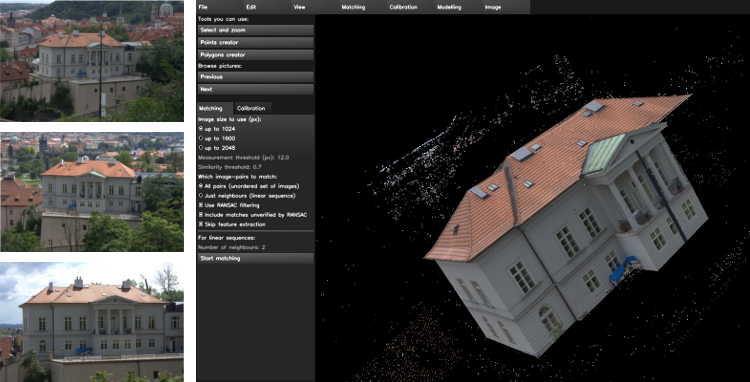
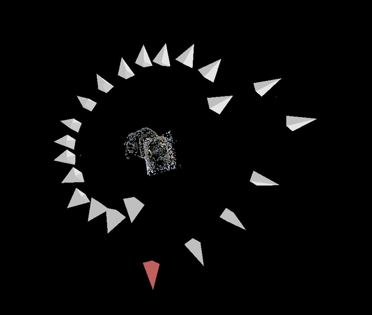

insight3d
=========

insight3d lets you create 3D models from photographs. You give it a series of photos of a real scene (e.g., of a building), it automatically matches them and then calculates positions in space from which each photo has been taken (plus camera’s optical parameters) along with a 3D pointcloud of the scene. You can then use insight3d’s modeling tools to create textured polygonal model.

We have a [tutorial available](https://insight3d.sourceforge.net/insight3d_tutorial.pdf).

Also note that some good people have forked insight3d and started the insight3dng project. You might want to check that out.

Disclaimer: This software is intended for educational purposes. Potential users in countries that allow software patents must first investigate whether or not this software package uses any algorithms patented in their respective countries and if so, refrain from using it.

Feel free to mail me: [lukas.mach@gmail.com](mailto:lukas.mach@gmail.com)
